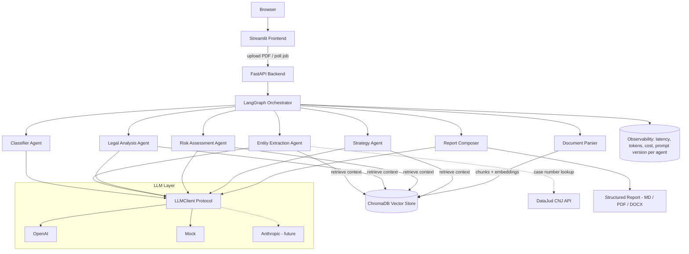

# Architecture

## System overview

## Layers

| Layer | Location | Responsibility |
|---|---|---|
| Core | `app/core` | Config, logging. No business logic. |
| LLM | `app/llm` | Provider-agnostic LLM access with built-in metering. |
| Schemas | `app/schemas` | Pydantic domain models - the contract between all agents. |
| Ingestion | `app/ingestion` | PDF -> text, OCR fallback, language detection. |
| RAG | `app/rag` | Chunking, embeddings, vector store port + ChromaDB adapter. |
| Agents | `app/agents` | Specialized agents; each = role + prompt + input/output schema. |
| Orchestration | `app/orchestration` | LangGraph graph wiring agents into a pipeline. |
| Services | `app/services` | Use cases (analyze lawsuit, export report). |
| API | `app/api` | FastAPI routes, async job management. |
| Frontend | `frontend/` | Streamlit UI. |

## Key principles

1. **Dependency rule**: outer layers depend on inner layers, never the
   reverse. Agents depend on `LLMClient` (protocol), not on OpenAI.
2. **Contracts as Pydantic schemas**: every agent's input and output is a
   validated model. Structured outputs are enforced at the API level
   (`response_format`), not with "please answer in JSON" prompts.
3. **Observability by construction**: `LLMCallMetadata` travels with every
   response - cost/latency/token tracking cannot be forgotten.
4. **Explainability**: every conclusion carries a confidence score, the
   reasoning behind it, and citations to source chunks.
5. **Swappable infrastructure**: LLM provider, vector store and (future)
   queue are behind ports; adapters are chosen in factories at composition
   roots.

## Design decisions

Recorded as ADRs in [`docs/adr/`](adr/). Highlights:

- [0001](adr/0001-use-langgraph.md) - LangGraph over LangChain chains
- [0002](adr/0002-llm-provider-abstraction.md) - Own LLM port instead of LiteLLM
- [0003](adr/0003-chromadb-vector-store.md) - ChromaDB behind a VectorStore port
- [0004](adr/0004-async-first.md) - Async-first from day one
