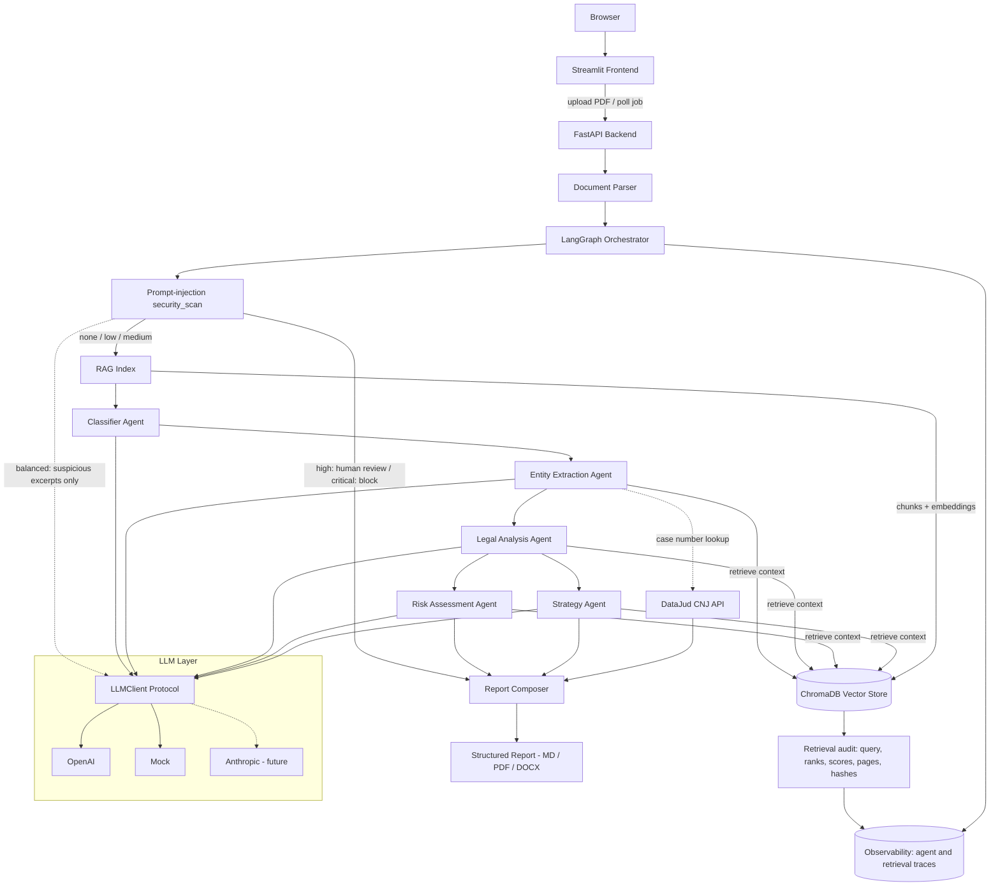

# Architecture

## System overview

```mermaid
flowchart TD
    B[Browser] --> F[Streamlit Frontend]
    F -->|upload PDF / poll job| A[FastAPI Backend]
    A --> P[Document Parser]
    P --> O[LangGraph Orchestrator]
    O --> PI[Prompt-injection security_scan]
    PI -->|none / low / medium| I[RAG Index]
    PI -->|high: human review / critical: block| G[Report Composer]
    I --> C[Classifier Agent]
    C --> E[Entity Extraction Agent]
    E --> L[Legal Analysis Agent]
    L --> R[Risk Assessment Agent]
    L --> S[Strategy Agent]
    R & S --> G
    E & L & R & S -->|retrieve context| RAG[(ChromaDB Vector Store)]
    RAG --> RT[Retrieval audit: query, ranks, scores, pages, hashes]
    RT --> OBS
    I -->|chunks + embeddings| RAG
    E -.->|case number lookup| DJ[DataJud CNJ API]
    DJ --> G
    subgraph LLM Layer
        LC[LLMClient Protocol]
        LC --> OAI[OpenAI]
        LC --> MOCK[Mock]
        LC -.-> ANT[Anthropic - future]
    end
    PI -.->|balanced: suspicious excerpts only| LC
    C & E & L & R & S --> LC
    G --> REP[Structured Report - MD / PDF / DOCX]
    O --> OBS[(Observability: agent and retrieval traces)]
```

## Layers

| Layer | Location | Responsibility |
|---|---|---|
| Core | `app/core` | Config, logging. No business logic. |
| LLM | `app/llm` | Provider-agnostic LLM access with built-in metering. |
| Schemas | `app/schemas` | Pydantic domain models - the contract between all agents. |
| Ingestion | `app/ingestion` | PDF -> text, OCR fallback, language detection. |
| Security | `app/security` | Bilingual prompt-injection detection, routing policy and context masking. |
| RAG | `app/rag` | Chunking, embeddings, vector store port + ChromaDB adapter. |
| Agents | `app/agents` | Specialized agents; each = role + prompt + input/output schema. |
| Orchestration | `app/orchestration` | LangGraph graph wiring agents into a pipeline. |
| Services | `app/services` | Use cases (analyze lawsuit, export report). |
| API | `app/api` | FastAPI routes, async job management. |
| Frontend | `frontend/` | Streamlit UI. |

## Key principles

1. **Dependency rule**: outer layers depend on inner layers, never the
   reverse. Agents depend on `LLMClient` (protocol), not on OpenAI.
2. **Contracts as Pydantic schemas**: every agent's input and output is a
   validated model. Structured outputs are enforced at the API level
   (`response_format`), not with "please answer in JSON" prompts.
3. **Observability by construction**: `LLMCallMetadata` travels with every
   response - cost/latency/token tracking cannot be forgotten.
4. **Explainability**: every conclusion carries a confidence score, the
   reasoning behind it, and citations to source chunks.
5. **Swappable infrastructure**: LLM provider, vector store and (future)
   queue are behind ports; adapters are chosen in factories at composition
   roots.
6. **Untrusted document boundary**: every page passes through
   `security_scan` before indexing. Deterministic Portuguese/English rules
   always run; `balanced` mode uses the LLM only to review suspicious
   excerpts, while explicit `strict` mode reviews all page text in bounded
   batches. The model cannot override the deterministic routing policy.
7. **Retrieval provenance by construction**: each agent trace retains every
   query's raw top-k ranking and separately marks the deduplicated chunks that
   reached the prompt. Full chunk text and vectors are excluded from run JSONL;
   SHA-256 hashes support integrity checks, and bounded previews are explicit
   opt-in because run history outlives the uploaded PDF by default.

## Retrieval audit and evaluation

The runtime trace records agent, query and query hash, effective `k`, embedding
and index versions, query/search latency, raw rank and score, document/chunk ID,
section, page span, indexed-text hash, and prompt inclusion. The trace remains
nested under the agent so parallel LangGraph branches cannot lose attribution.
Embedding and vector-search failures retain attempted queries, successful
sibling lookups, and the consuming agent's status/error instead of disappearing
from the audit trail.

Production runs expose descriptive telemetry and citation-to-context coverage.
Relevance metrics require labels, so Precision@K, Recall@K, HitRate@K, MRR@K,
and NDCG@K run offline against golden page-range and passage judgments.

## Prompt-injection routing

| Risk | Pipeline action |
|---|---|
| `none` / `low` | Continue to indexing and analysis. |
| `medium` | Continue with a report warning; mask flagged excerpts in downstream prompts while preserving the source document. |
| `high` | Halt analysis with job state `review_required`. |
| `critical` | End with job state `blocked`. |

Every finding records the category, severity, source page, verbatim excerpt,
reasoning and confidence. Findings are part of the structured report and are
shown in the frontend and exports.

## Design decisions

Recorded as ADRs in [`docs/adr/`](adr/). Highlights:

- [0001](adr/0001-use-langgraph.md) - LangGraph over LangChain chains
- [0002](adr/0002-llm-provider-abstraction.md) - Own LLM port instead of LiteLLM
- [0003](adr/0003-chromadb-vector-store.md) - ChromaDB behind a VectorStore port
- [0004](adr/0004-async-first.md) - Async-first from day one
- [0010](adr/0010-prompt-injection-security-gate.md) - Pre-index prompt-injection security gate
- [0011](adr/0011-retrieval-traceability-and-evaluation.md) - Retrieval audit and ranking metrics
